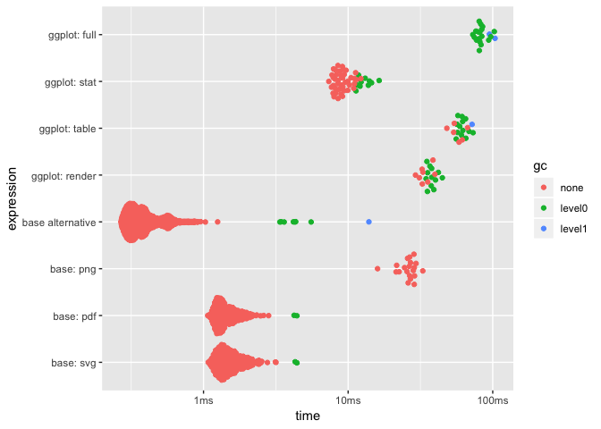
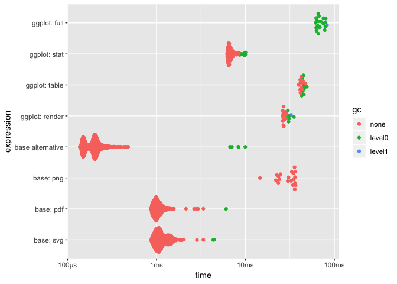
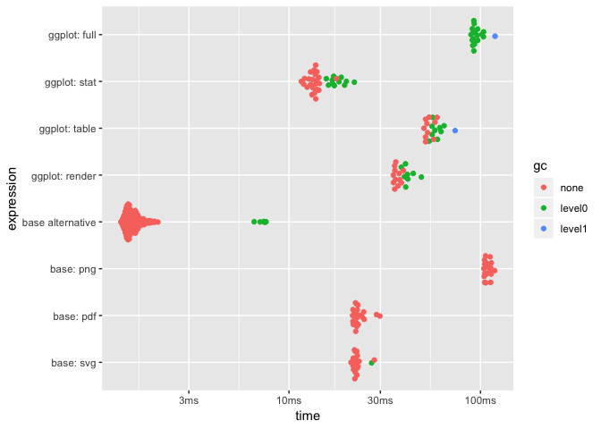
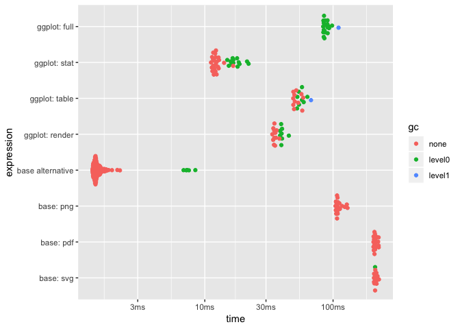
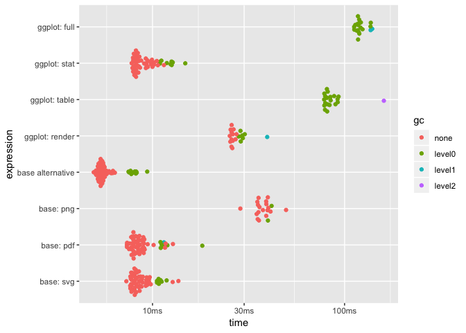
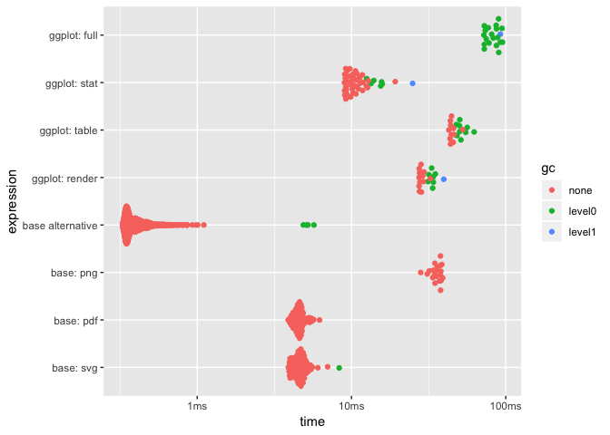
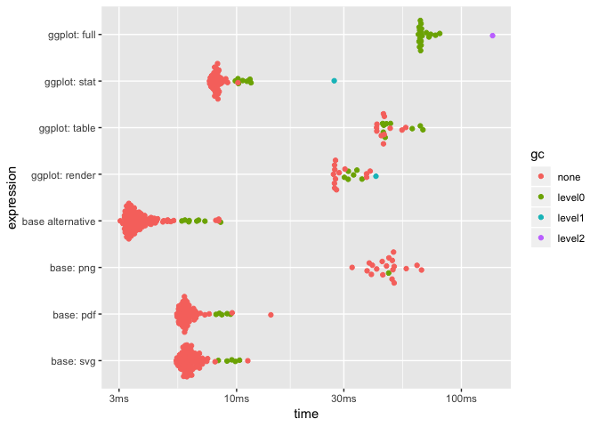
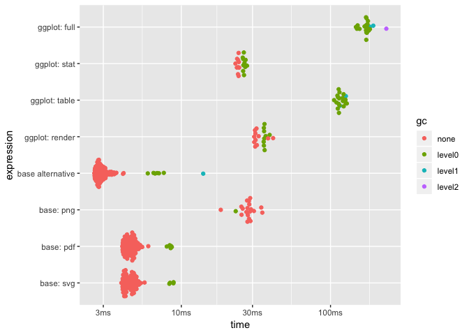
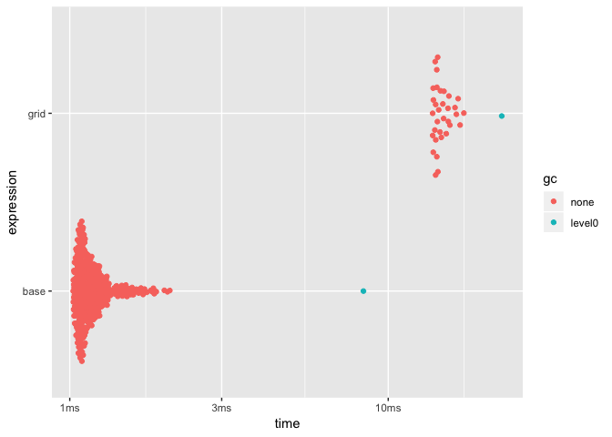

High-level Graphics Benchmarking
================

The purpose of this document is to get an overview of the different
performance bottlenecks involved in plotting data in R. It is structured
as a pretty high level overview and will not incorporate profiling at
the function level. Rather, it will try to quantisize the overall
operations of plotting to identify the areas most ripe for improvements.
The focus will be on the ggplot2 stack, but grid vs. base comparisons
will be incoorporated as well to get a sense of the overhead grid itself
provides.

## Setup

Different plotting operations might show overheads in different places
so it is necessary to setup a repeatable benchmarking procedure that
makes it easy to benchmark a range of different plotting procedures:

``` r
graph_bench <- function(ggplot, base = function() NULL) {
  base <- enquo(base)
  trash_dir <- tempfile()
  dir.create(trash_dir, recursive = TRUE)
  on.exit(unlink(trash_dir, recursive = TRUE))
  ggplot_stat <- ggplot_build(ggplot)
  ggplot_table <- ggplot_gtable(ggplot_stat)
  total <- function() {
    void_dev()
    plot(ggplot)
    dev.off()
    NULL
  }
  stat <- function() {
    ggplot_build(ggplot)
    NULL
  }
  table <- function() {
    ggplot_gtable(ggplot_stat)
    NULL
  }
  render <- function() {
    void_dev()
    grid.draw(ggplot_table)
    dev.off()
    NULL
  }
  base_void <- function() {
    void_dev()
    eval_tidy(base)
    dev.off()
    NULL
  }
  base_png <- function() {
    png(tempfile(tmpdir = trash_dir))
    eval_tidy(base)
    dev.off()
    NULL
  }
  base_pdf <- function() {
    pdf(tempfile(tmpdir = trash_dir))
    eval_tidy(base)
    dev.off()
    NULL
  }
  base_svg <- function() {
    svglite(tempfile(tmpdir = trash_dir))
    eval_tidy(base)
    dev.off()
    NULL
  }
  
  mark(
    "ggplot: full" = total(),
    "ggplot: stat" = stat(),
    "ggplot: table" = table(),
    "ggplot: render" = render(),
    "base alternative" = base_void(),
    "base: png" = base_png(),
    "base: pdf" = base_pdf(),
    "base: svg" = base_pdf(),
    min_iterations = 20
  )
}
plot_bench <- function(x, log = TRUE) {
  p <- plot(x)
  if (!log) p <- p + scale_y_continuous()
  p + scale_x_discrete(limits = rev(c(
    "ggplot: full",
    "ggplot: stat",
    "ggplot: table",
    "ggplot: render",
    "base alternative",
    "base: png",
    "base: pdf",
    "base: svg"
  )))
}
```

The battery of benchmarking should allow us to find out which part of
the rendering is taking the lion share of computing time - an example:

``` r
data <- data.frame(x = runif(10), y = runif(10))
points <- graph_bench(
  ggplot(data) + geom_point(aes(x, y)),
  plot(data$x, data$y)
)
```

    ## Warning: Some expressions had a GC in every iteration; so filtering is
    ## disabled.

``` r
plot_bench(points)
```

<!-- -->

The ggplot rows show both the total drawing time as well as broken down
into the different overall stages (stat calculations, grob creation, and
rendering). The base rows both gives a comparison for a similar drawing
task as well as shows how the different graphic devices perform on this
particular drawing task.

## Benchmarking

Below is an ever-growing list of different plotting tasks and how they
perform. If possible, the plots are of medium density in terms of data,
to ensure that a fair amount of rendering is taking place

### Nothing

This first entry measures the time it takes to set up the canvas without
plotting anything additional:

``` r
base_canvas <- function() {
    plot.new()
    plot.window(c(0,1), c(0,1))
    Axis(seq(0, 1, by = 0.25), side = 1)
    Axis(seq(0, 1, by = 0.25), side = 2)
    box()
    title(xlab = 'x', ylab = 'y')
  }
res <- graph_bench(
  ggplot(data) + 
    scale_x_continuous('x', limits = c(0,1)) + 
    scale_y_continuous('y', limits = c(0,1)),
  base_canvas()
)
```

    ## Warning: Some expressions had a GC in every iteration; so filtering is
    ## disabled.

``` r
plot_bench(res)
```

<!-- -->

### Points

Maybe the most used type of plot in R. Any improvement here will be felt
by many:

``` r
data <- data.frame(x = rnorm(1e4), y = rnorm(1e4))
res <- graph_bench(
  ggplot(data) + geom_point(aes(x, y)),
  plot(data$x, data$y)
)
```

    ## Warning: Some expressions had a GC in every iteration; so filtering is
    ## disabled.

``` r
plot_bench(res)
```

<!-- -->

Let’s look at the effect of opacity as well

``` r
res <- graph_bench(
  ggplot(data) + geom_point(aes(x, y), alpha = 0.3),
  plot(data$x, data$y, col = "#0000004D")
)
```

    ## Warning: Some expressions had a GC in every iteration; so filtering is
    ## disabled.

``` r
plot_bench(res)
```

<!-- -->

### Lines

``` r
data <- data.frame(
  x = runif(1e3),
  y = runif(1e3),
  id = rep(seq_len(100), each = 10)
)
data_list <- split(data, data$id)
res <- graph_bench(
  ggplot(data) + geom_path(aes(x, y, group = id)),
  (function() {
    base_canvas()
    for (i in seq_along(data_list)) {
      lines(data_list[[i]]$x, data_list[[i]]$y, type = 'l')
    }
  })()
)
```

    ## Warning: Some expressions had a GC in every iteration; so filtering is
    ## disabled.

``` r
plot_bench(res)
```

<!-- -->

### Line segments

``` r
data <- data.frame(
  x = runif(1e3),
  y = runif(1e3),
  x1 = runif(1e3),
  y1 = runif(1e3)
)
res <- graph_bench(
  ggplot(data) + geom_segment(aes(x, y, xend = x1, yend = y1)),
  (function() {
    base_canvas()
    segments(data$x, data$y, data$x1, data$y1)
  })()
)
```

    ## Warning: Some expressions had a GC in every iteration; so filtering is
    ## disabled.

``` r
plot_bench(res)
```

<!-- -->

### Polygons

``` r
data <- data.frame(
  x = runif(1e3),
  y = runif(1e3),
  id = rep(seq_len(100), each = 10)
)
data_list <- split(data, data$id)
res <- graph_bench(
  ggplot(data) + geom_polygon(aes(x, y, group = id), colour = 'black', fill = 'grey'),
  (function() {
    base_canvas()
    for (i in seq_along(data_list)) {
      polygon(data_list[[i]]$x, data_list[[i]]$y, border = 'black', col = 'grey')
    }
  })()
)
```

    ## Warning: Some expressions had a GC in every iteration; so filtering is
    ## disabled.

``` r
plot_bench(res)
```

<!-- -->

### Composites

``` r
data <- data.frame(
  x = sample(letters[1:10], 1000, TRUE),
  y = rexp(1000)
)
res <- graph_bench(
  ggplot(data) + geom_boxplot(aes(x, y)),
  boxplot(data$y ~ data$x)
)
```

    ## Warning: Some expressions had a GC in every iteration; so filtering is
    ## disabled.

``` r
plot_bench(res)
```

<!-- -->

### Grid vs base

To get a sense of how performant the two underlying drawing systems are
at a basic level we’ll try to measure some dot-drawing (the tests above
indicates little difference in drawing dots, lines, and polygons)

``` r
data <- data.frame(
  x = runif(1e4),
  y = runif(1e4)
)

res <- mark(
  grid = (function() {
    void_dev()
    grid.points(data$x, data$y)
    dev.off()
    NULL
  })(),
  base = (function() {
    void_dev()
    plot.new()
    plot.window(c(0,1), c(0,1))
    points(data$x, data$y)
    dev.off()
    NULL
  })()
)
plot(res)
```

<!-- -->

## Take-aways

  - `ggplot2` is (surprise) considerably slower than base graphics. That
    is okay as it allows for more, so simple operations are likely to
    have unnecessary overhead. It is too slow though…
  - The slowest part of `ggplot2` rendering is the `ggplot_gtable()`
    step where grobs are created and assembled into the final gtable. It
    is obvious based on the boxplot example that more complicated grobs
    take measurable time to construct, but gtable itself is also likely
    to take some time.
  - The overhead of the `ggplot_build()` step is relatively low,
    considering the amount of computation it contains (even for
    StatIdentity layers). Further, changes to this are fairly complex so
    it is likely that this is the last place to look for improvements.
  - There is not much change in rendering speed between an empty plot
    and any of the filled ones so it is clear that `grid` itself has
    more trouble calculating the layout of the plot, rather than
    actually drawing stuff. That being said, it is clear that grid is
    slower than base at this task as well
  - The graphic devices themselves take up a significant chunk of the
    computations and their performance seem to be related to the number
    of single graphic elements more than the complexity of the elements
    (it is slower to draw 1000 points than 10 lines between 100 points
    each). This indicates potential shortcomings in the interface
    between the graphic system and the devices.
  - The svglite and pdf device are surprisingly slow at rendering
    translucency even though it *should* not matter. This might be
    because they group each element and applies translucency to the
    group rather than just modify the colour of each element.
